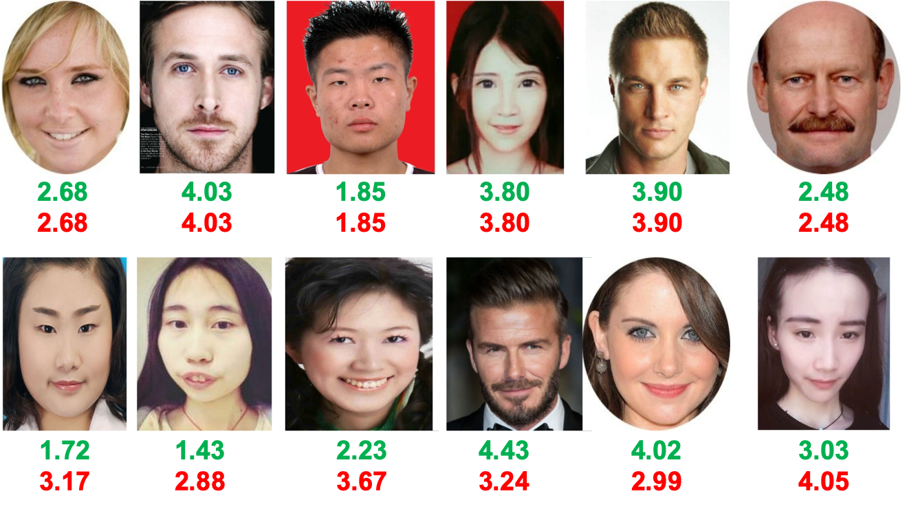

# ComboLoss for Facial Attractiveness Analysis with Squeeze-and-Excitation Networks
## Introduction
This repository holds the PyTorch implementation of **ComboLoss** for facial attractiveness analysis. With SEResNeXt50 as backbone, ComboLoss achieves state-of-the-art performance on ``SCUT-FBP, HotOrNot and SCUT-FBP5500 dataset``, which outperforms many methods published at IJCAI, IEEE Transactions on Affective Computing, ICIP, ICASSP, ICPR, PCM and etc.


If you find the code helps your research, please cite this project as:
```
@article{xu2020comboloss,
  title={ComboLoss for Facial Attractiveness Analysis with Squeeze-and-Excitation Networks},
  author={Xu, Lu and Xiang, Jinhai},
  journal={arXiv preprint arXiv:2010.10721},
  year={2020}
}
```

Pretrained Models on SCUT-FBP5500 with 60%/40% data splitting setting: [ComboLoss_SCUT-FBP5500](https://drive.google.com/open?id=1O9T41BJglXBWlm6nJCuHIGzl3iSDvBdc)

## Data Description
| Dataset | Median | Mean |
| :---: | :---: | :---: |
| SCUT-FBP | 2.549 | 2.694 |
| HotOrNot | 0.0369 | 0.0039 |
| SCUT-FBP5500 | 3 | 2.99 |


## Performance Evaluation
### Evaluation & Ablation Analysis on SCUT-FBP5500 (6/4 splitting strategy)
| Backbone | Loss | MAE | RMSE | PC |
| :---: | :---: | :---: | :---: | :---: |
| SEResNeXt50 | L1 | 0.2212 | 0.2941 | 0.9012 |
| SEResNeXt50 | MSE | 0.2189 | 0.2907 | 0.9041 |
| SEResNeXt50 | SmoothL1 | 0.2204 | 0.2901 | 0.9050 |
| ComboNet (SEResNeXt50) | CombinedLoss (alpha=1, beta=1, gamma=1) | 0.2135 | 0.2818 | 0.9099 |
| ComboNet (SEResNeXt50)  | CombinedLoss (alpha=2, beta=1, gamma=1) | 0.2191 | 0.2891 | 0.9066 |
| ComboNet (SEResNeXt50)  | CombinedLoss (alpha=2, beta=1, gamma=1) | 0.2126 | 0.2813 | 0.9117 |
| ComboNet (SEResNeXt50)  | CombinedLoss (alpha=3, beta=1, gamma=1) | 0.2190 | 0.2894 | 0.9053 |
| ComboNet (SEResNeXt50)  | CombinedLoss (alpha=1, beta=2, gamma=1) | 0.2150 | 0.2868 | 0.9063 |
| ComboNet (SEResNeXt50)  | CombinedLoss (alpha=1, beta=2, gamma=1) | 0.2176 | 0.2895 | 0.9044 |
| ComboNet (SEResNeXt50)  | CombinedLoss (alpha=1, beta=3, gamma=1) | 0.2171 | 0.2862 | 0.9071 |
| ComboNet (ResNet18)  | CombinedLoss (alpha=1, beta=1, gamma=1) | 0.2215 | 0.2936 | 0.9021 |
| ComboNet (ResNet18)  | CombinedLoss (alpha=1, beta=2, gamma=1) | 0.2202 | 0.2907 | 0.9041 |
| ComboNet (ResNet18)  | CombinedLoss (alpha=1, beta=3, gamma=1) | 0.2252 | 0.2991 | 0.8980 |
| ComboNet (ResNet18)  | CombinedLoss (alpha=2, beta=1, gamma=1) | 0.2557 | 0.3362 | 0.8780 |
| ComboNet (ResNet18)  | CombinedLoss (alpha=3, beta=1, gamma=1) | 0.2513 | 0.3364 | 0.8788 |



### Evaluation on SCUT-FBP
| Backbone | CV | MAE | RMSE | PC |
| :---: | :---: | :---: | :---: | :---: |
|  ComboNet (SEResNeXt50)  | 1 | 0.2689 | 0.3340 | 0.9144 |
|  ComboNet (SEResNeXt50)  | 2 | 0.2456 | 0.3050 | 0.9063 |
|  ComboNet (SEResNeXt50)  | 3 | 0.2436 | 0.3095 | 0.9082 |
|  ComboNet (SEResNeXt50)  | 4 | 0.2282 | 0.2992 | 0.9238 |
|  ComboNet (SEResNeXt50)  | 5 | 0.2171 | 0.2889 | 0.9051 |
|  ComboNet (SEResNeXt50)  | AVG | 0.2441 | 0.3122 | 0.9090 |

### Evaluation on HotOrNot
| Backbone | CV | MAE | RMSE | PC |
| :---: | :---: | :---: | :---: | :---: |
| ComboNet (SEResNeXt50) | 1 | 0.8207 | 1.0379 | 0.5168 |
| ComboNet (SEResNeXt50) | 2 | 0.8273 | 1.0552 | 0.5004 |
| ComboNet (SEResNeXt50) | 3 | 0.8223 | 1.0399 | 0.5148 |
| ComboNet (SEResNeXt50) | 4 | 0.8108 | 1.0241 | 0.5080 |
| ComboNet (SEResNeXt50) | 5 | 0.8256 | 1.0487 | 0.4747 |
| ComboNet (SEResNeXt50) | AVG | 0.8213 | 1.0412 | 0.5029 |


### Evaluation on SCUT-FBP5500 (5-Fold Cross Validation)
| Backbone | CV | MAE | RMSE | PC |
| :---: | :---: | :---: | :---: | :---: |
| ComboNet (SEResNeXt50)  | 1 | 0.2119 | 0.2751 | 0.9157 |
| ComboNet (SEResNeXt50)  | 2 | 0.2084 | 0.2751 | 0.9164 |
| ComboNet (SEResNeXt50)  | 3 | 0.1998 | 0.2711 | 0.9215 |
| ComboNet (SEResNeXt50)  | 4 | 0.2050 | 0.2693 | 0.9208 |
| ComboNet (SEResNeXt50)  | 5 | 0.1999 | 0.2615 | 0.9250 |
| ComboNet (SEResNeXt50)  | AVG | 0.2050 | 0.2704 | 0.9199 |


## Comparison with prior arts on SCUT-FBP5500
| Models | Published At | MAE | RMSE | PC |
| :---: | :---: | :---: | :---: | :---: |
| ResNeXt-50 | CVPR'16 | 0.2291 | 0.3017 | 0.8997 |
| ResNet-18	| CVPR'16 | 0.2419 | 0.3166 | 0.8900 |
| AlexNet | NIPS'12 | 0.2651 | 0.3481	| 0.8634 |
| HMTNet | ICIP'19 | 0.2380 | 0.3141 | 0.8912 |
| AaNet | IJCAI'19 | 0.2236 | 0.2954 | 0.9055 |
| R^2 ResNeXt  | ICPR'18 | 0.2416 | 0.3046 | 0.8957 |
| R^3CNN | IEEE Trans on Affective Computing | 0.2120 | 0.2800 | 0.9142 |
| **ComboLoss (Ours)** | - | **0.2050** | **0.2704** | **0.9199** |

## Ablation Study (6/4 splitting strategy)
| Model | w/wo balanced Xent Loss | MAE | RMSE | PC |
| :---: | :---: | :---: | :---: | :---: |
| SEResNeXt50 + ComboLoss | w | **0.2126** | **0.2813** | **0.9117** |
| SEResNeXt50 + ComboLoss | wo | 0.2115 | 0.2814 | 0.9099 |


## Reference
1. Xu L, Xiang J, Yuan X. [CRNet: Classification and Regression Neural Network for Facial Beauty Prediction](https://link.springer.com/chapter/10.1007/978-3-030-00764-5_61)[C]//Pacific Rim Conference on Multimedia. Springer, Cham, 2018: 661-671.
2. Lin L, Liang L, Jin L, et al. [Attribute-aware convolutional neural networks for facial beauty prediction](https://www.ijcai.org/proceedings/2019/0119.pdf)[C]//Proceedings of the 28th International Joint Conference on Artificial Intelligence. AAAI Press, 2019: 847-853.
3. Xu L, Fan H, Xiang J. [Hierarchical Multi-Task Network For Race, Gender and Facial Attractiveness Recognition](https://ieeexplore.ieee.org/abstract/document/8803614/)[C]//2019 IEEE International Conference on Image Processing (ICIP). IEEE, 2019: 3861-3865.
4. Liu X, Li T, Peng H, et al. [Understanding beauty via deep facial features](http://openaccess.thecvf.com/content_CVPRW_2019/papers/AMFG/Liu_Understanding_Beauty_via_Deep_Facial_Features_CVPRW_2019_paper.pdf)[C]//Proceedings of the IEEE Conference on Computer Vision and Pattern Recognition Workshops. 2019: 0-0.
5. Liang L, Lin L, Jin L, et al. [SCUT-FBP5500: A diverse benchmark dataset for multi-paradigm facial beauty prediction](https://arxiv.org/pdf/1801.06345.pdf)[C]//2018 24th International Conference on Pattern Recognition (ICPR). IEEE, 2018: 1598-1603.
6. Lin L, Liang L, Jin L. [Regression Guided by Relative Ranking Using Convolutional Neural Network (R3CNN) for Facial Beauty Prediction](https://ieeexplore.ieee.org/abstract/document/8789541/)[J]. IEEE Transactions on Affective Computing, 2019.
7. Lin L, Liang L, Jin L. [R 2-ResNeXt: A ResNeXt-Based Regression Model with Relative Ranking for Facial Beauty Prediction](https://ieeexplore.ieee.org/abstract/document/8545164/)[C]//2018 24th International Conference on Pattern Recognition (ICPR). IEEE, 2018: 85-90.
